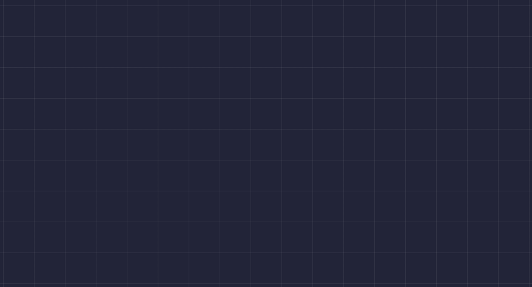

# Importent Codes

> html / css [bem / scss] / js

---

> এই কোড দিয়ে পেজের মধ্যে Harizantal & varitcal দাগ বসানো যায়।
> 

```css
main {
  width: 100%;
  height: 100vh;
  overflow: hidden;
  background-image: repeating-linear-gradient(
      to right,
      transparent 0 50px,
      #fff1 50px 51px
    ), repeating-linear-gradient(to bottom, transparent 0 50px, #fff1 50px 51px);
}
```

---

#### ওয়েবসাইটের ইন্সপেক্ট ইলিমেন্ট বা রাইট ক্লিক বন্ধ করতে এইকোড ব্যবহার হয়।

```javascript
document.addEventListener("contextmenu", (e) => e.preventDefault(), false);
```
