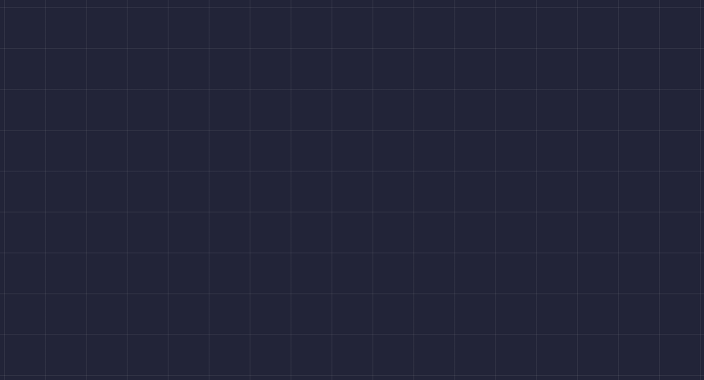

# Importent Codes

---

> এই কোড দিয়ে পেজের মধ্যে Harizantal & varitcal দাগ বসানো যায়।
> 

```css
main {
  width: 100%;
  height: 100vh;
  overflow: hidden;
  background-image: repeating-linear-gradient(
      to right,
      transparent 0 50px,
      #fff1 50px 51px
    ), repeating-linear-gradient(to bottom, transparent 0 50px, #fff1 50px 51px);
}
```
