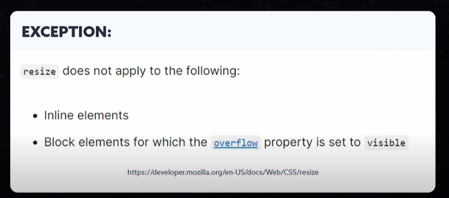
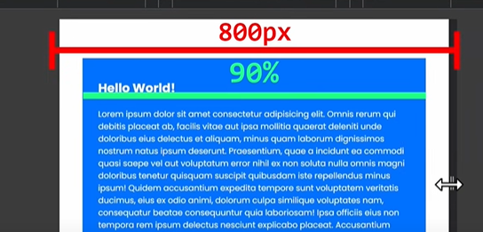

# CSS Code Tricks

---

> Controle Height with width of elements

```css
.elements {
  resize: vertical;
  resize: horizontal;
  resize: both;
}
```



---

> new Morphism

```css
body {
  background-color: #f9f9f9;
}

.element:hover {
  box-shadow: 12px 12px 12px rgba(0, 0, 0, 0.1), -10px -10px -10px #fff;
}

.element:hover {
  box-shadow: 12px 12px 12px rgba(0, 0, 0, 0.1) inset, -10px -10px -10px #fff
      inset;
}
```

---

> use checkboxes instead of javascript

```html
<input type="checkbox" id="mychackbox" />
<label for="mycheckbox"> My Label </label>
```

```css
.container {
  display: none;
}

#mycheckbox:checked ~ .container {
  display: block;
}

#mychackbox {
  display: none;
}
```

---

```css
.container {
  width: 800px;
  max-width: 90%;
  /* 2 line code in one line */
  width: min(800px, 90%);
}

.container {
  width: 800px;
  max-width: 90%;
  /* 2 line code in one line */
  width: max(800px, 90%);
}
```

## 

---

```css
.container {
  /* min , preferred, max */
  width: clamp(400px, 50vw, 800px);
}
```

---

> Glassmorphisom

```css

```

```css

```

```css

```
